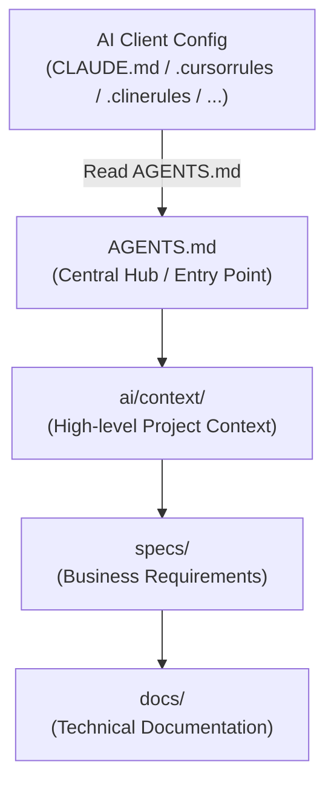

# ai-context-tree

> **Universal Project Structure for AI-First Development & Multi-Agent Collaboration**

[](LICENSE)
[](https://github.com/your-username/ai-context-tree/pulls)
[](docs/01-philosophy.md)

`ai-context-tree` is a language-agnostic, framework-agnostic project layout designed specifically to optimize **Context Management** in LLM-assisted development. It works seamlessly and concurrently with multiple AI clients—including **Claude Code, Cursor, Cline, Roo Code, Windsurf, Antigravity, Gemini CLI**, and others—without requiring repo-level refactoring when switching tools.

---

## 📖 Table of Contents

- **Core Concepts:**
  - [📖 Philosophy & Purpose](docs/01-philosophy.md) — Why design repositories for both humans and AI.
  - [🛠️ The 5 Core Principles](docs/02-core-principles.md) — SSOT, predictability, file sizes, proximity, and tool independence.
  - [🌱 Incremental Growth Principle](docs/03-incremental-growth.md) — How the repository tree grows organically on demand.
  - [🏷️ Terminology Management](docs/04-terminology-management.md) — Handling technical vs business terms.
  - [🤖 AI Client Integration Guide](docs/05-ai-integration.md) — Pointing Cursor, Claude, Cline, etc., to your rules.
  - [📘 Spec-Driven Development (SDD)](knowledge/Spec-Driven%20Development.md) — How our layout supports living specs and prevents vibe coding.
  - [🚀 Repository Initialization Guide](docs/06-initialization-guide.md) — How to bootstrap the structure using scripts.

- **File Templates:**
  - [📂 Replicated Structure Templates](file-templates/) — Got standard code/doc templates for every directory.
- **Directory Guidelines:**
  - [Root Files](docs/structure/root-files.md) — `AGENTS.md`, `MANIFEST.md`, `.gitignore`, etc.
  - [AI Agent Rules & Workflows (`ai/`)](docs/structure/ai-agents.md) — Coding conventions, step-by-step procedures, prompts.
  - [Business specifications & contracts](docs/structure/business-knowledge.md) — `specs/`, `contracts/`, `knowledge/`, `decisions/`.
  - [Implementation files](docs/structure/implementation.md) — `src/`, `tests/`, `config/`, `scripts/`, `tools/`.
  - [Supporting directories](docs/structure/supporting.md) — `examples/`, `plans/`, `prototypes/`, `archive/`.

---

## 🗺️ Information & Context Flow

To keep the workspace clean and avoid polluting the LLM's context, information flows through a clear hierarchy. IDE-specific configuration files act as thin pointers to `AGENTS.md`, which serves as the central hub:



---

## 📁 Repository Structure Snapshots

The structure grows **incrementally** (as described in the [Incremental Growth Guide](docs/03-incremental-growth.md)). Below are snapshots illustrating how a project starts and how it matures.

### 1. Minimal Structure (Starting Point)
Every project starts here. It includes the absolute essentials for code, tests, and AI context mapping:

```txt
project/
├── AGENTS.md           # Entrypoint for AI agents (refer to file-templates/AGENTS.md)
├── MANIFEST.md         # Index map of all currently existing files (refer to file-templates/MANIFEST.md)
├── README.md           # Human-focused overview (refer to file-templates/README.md)
├── .gitignore          # Ignores build artifacts and tmp/ (refer to file-templates/.gitignore)
├── ai/
│   ├── context/        # Project goals, stack, and structure map
│   ├── rules/          # Coding conventions and syntax standards
│   ├── workflows/      # Step-by-step procedures (refer to file-templates/ai/workflows/new-feature.md)
│   ├── skills/         # Local agent skills (refer to file-templates/ai/skills/example-skill.md)
│   ├── history/        # Conversation memory logs
│   └── runs/           # Reusable execution scripts
├── docs/               # System and technical documentation
├── src/                # Application source code
├── tests/              # Test suites
└── tmp/                # Temporary directory (excluded from git/CI)
```

### 2. Target Structure Example (Mature/AI-Native Project)

As the project grows, new directories and files are created dynamically to match your requirements. The repository structure is designed to be organic and should expand strictly on demand, which is why there is no single "ideal" complete structure for every project. 

If you follow the guidelines in [ai-agents structure guide](docs/structure/ai-agents.md) and `ai/context/structure-map.md`, your mature project structure might look like this:

```txt
project/
├── AGENTS.md           # Entrypoint for AI agents
├── MANIFEST.md         # Index map of all currently existing files
├── README.md           # Human-focused overview
├── CHANGELOG.md        # Version history
├── ROADMAP.md          # Future plans
├── TODO.md             # Active task backlog
├── LICENSE             # Project license
├── ai/
│   ├── context/        # High-level context & project stack
│   ├── rules/          # Coding, testing, and git conventions
│   ├── workflows/      # Step-by-step procedures (e.g. release, bugfix)
│   ├── prompts/        # Generic user-triggered prompts
│   ├── templates/      # Code scaffolding templates
│   ├── skills/         # Project-specific agent skills
│   ├── history/        # Conversation memory logs
│   ├── runs/           # Reusable execution scripts
│   └── memory/         # Lessons learned & technical debt records
├── specs/              # Business specs & acceptance criteria
├── contracts/          # API contracts (OpenAPI, Protobuf, GraphQL)
├── docs/               # System & technical architecture documentation
├── knowledge/          # Domain knowledge base (faq, terminology, personas)
├── decisions/          # Architecture Decision Records (ADRs)
├── research/           # Spike results, benchmarks, and competitor analysis
├── infrastructure/     # DevOps (Docker, Terraform, K8s)
├── config/             # Centralized tool configurations
├── scripts/            # Build, seed, and automation scripts
├── tools/              # Local CLI helpers and utilities
├── examples/           # Code usage examples (Few-Shot learning context)
├── plans/              # Epic design plans linked to TODOs
├── experiments/        # PoCs and sandbox experiments
├── archive/            # Legacy code kept for history but hidden from agent focus
├── assets/             # Static files (images, fonts, design assets)
└── tmp/                # Temporary directory (excluded from git/CI)
```

---

## 🚀 Getting Started

### 1. Initialize the Structure
You can quickly generate the minimal structure in your workspace root by running the initialization script.

> [!IMPORTANT]
> The scripts require the `file-templates/` directory to run. If you are setting up a new/existing project, you must copy **both** the script and the `file-templates/` directory to your project's root folder.
> For step-by-step instructions, see the [Repository Initialization Guide](docs/06-initialization-guide.md).

**For macOS / Linux (Bash):**
```bash
chmod +x ./create_minimal_structure.sh
./create_minimal_structure.sh
```

**For Windows (PowerShell):**

```powershell
./create_minimal_structure.ps1
```

### 2. Connect Your AI Clients
Keep your IDE/AI config files clean. Point them directly to `AGENTS.md` with a 2–3 line instruction.

For detailed pointer files for Cursor, Claude Code, Cline, Roo Code, and Windsurf, see the [AI Client Integration Guide](docs/05-ai-integration.md).

---

## 📄 License

This layout standard is open-source and available under the [MIT License](LICENSE).
