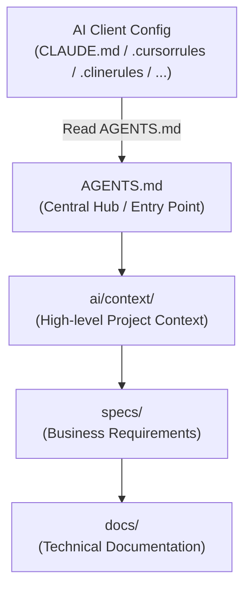

# ai-context-tree

> **Universal Project Structure for AI-First Development & Multi-Agent Collaboration**

[](LICENSE)
[](https://github.com/your-username/ai-context-tree/pulls)
[](#philosophy)

`ai-context-tree` is a language-agnostic, framework-agnostic project layout designed specifically to optimize **Context Management** in LLM-assisted development. It works seamlessly and concurrently with multiple AI clients—including **Claude Code, Cursor, Cline, Roo Code, Windsurf, Antigravity, Gemini CLI**, and others—without requiring repo-level refactoring when switching tools.

---

## 📖 Philosophy

In the era of AI-assisted engineering, repositories are no longer designed solely for human eyes. A modern project is co-inhabited by:
- **Developers** (Human engineers)
- **AI Assistants & Autocomplete engines**
- **Autonomous Agents** (e.g., Claude Code, Cline, Antigravity)
- **Specialized Agents** (Code Review, DevOps, Testing)

The primary limitation of modern LLMs is not code generation, but **Context Management**. Large files, dispersed rules, and duplicated documentation waste context tokens, lead to hallucinations, and degrade agent performance. 

`ai-context-tree` solves this by introducing a strict, predictable hierarchy that treats humans and AI as first-class citizens using a **Single Source of Truth (SSOT)**.

---

## 🛠️ The 5 Core Principles

1. **Single Source of Truth (SSOT)**: Every piece of information (architecture, guidelines, business domain) exists in exactly one place. Other files link to it; they never duplicate it.
2. **AI Should Not Guess**: If the project has naming conventions, design patterns, or workflows, they must be documented in the `ai/` folder so agents can follow them deterministically.
3. **Small Files & Single Responsibility**: Keep files small (100–300 lines) and focus on one responsibility. LLMs analyze modular codebases with significantly higher accuracy.
4. **Documentation Close to Code**: Code describes *how*; documentation in `docs/` describes *why*, *when*, and *what*.
5. **IDE & Tool Independence**: Do not write complex instructions inside tool-specific config files (e.g., Cursor rules, `.clinerules`). Keep configuration files to a minimal 2–3 lines that point directly to [AGENTS.md](AGENTS.md).

---

## 🗺️ Information & Context Flow

To keep the workspace clean and avoid polluting the LLM's context, information flows through a clear hierarchy. IDE-specific files act as thin pointers to [AGENTS.md](AGENTS.md), which serves as the central hub:



---

## 📁 Repository Structure Snapshots

`ai-context-tree` grows **incrementally**. You start with the `MINIMAL` tree and add folders only when a specific, real need arises (e.g., creating `decisions/` when you write your first ADR).

### 1. Minimal Structure (Starting Point)
Every project starts here. It includes the absolute essentials for code, tests, and AI context mapping:

```txt
project/
├── AGENTS.md           # Entrypoint for AI agents
├── README.md           # Human-focused overview
├── .gitignore          # Ignores build artifacts and tmp/
├── ai/
│   ├── context/        # Project goals, stack, and structure map
│   └── rules/          # Coding conventions and syntax standards
├── docs/               # System and technical documentation
├── src/                # Application source code
└── tests/              # Test suites
```

### 2. Full Structure (Mature/AI-Native Project)
As the project grows, new directories are created based on the definitions in [ai/context/structure-map.md](ai/context/structure-map.md):

```txt
project/
├── AGENTS.md           # Entrypoint for AI agents
├── MANIFEST.md         # Index map of all currently existing files
├── README.md           # Human-focused overview
├── CHANGELOG.md        # Version history
├── ROADMAP.md          # Future plans
├── TODO.md             # Active task backlog
├── LICENSE             # Project license
├── ai/
│   ├── context/        # High-level context & project stack
│   ├── rules/          # Coding, testing, and git conventions
│   ├── workflows/      # Step-by-step procedures (e.g. release, bugfix)
│   ├── prompts/        # Generic user-triggered prompts
│   ├── templates/      # Code scaffolding templates
│   └── memory/         # Lessons learned & technical debt records
├── specs/              # Business specs & acceptance criteria
├── contracts/          # API contracts (OpenAPI, Protobuf, GraphQL)
├── docs/               # System & technical architecture documentation
├── knowledge/          # Domain knowledge base (faq, terminology, personas)
├── decisions/          # Architecture Decision Records (ADRs)
├── research/           # Spike results, benchmarks, and competitor analysis
├── infrastructure/     # DevOps (Docker, Terraform, K8s)
├── config/             # Centralized tool configurations
├── scripts/            # Build, seed, and automation scripts
├── tools/              # Local CLI helpers and utilities
├── examples/           # Code usage examples (Few-Shot learning context)
├── plans/              # Epic design plans linked to TODOs
├── experiments/        # PoCs and sandbox experiments
├── archive/            # Legacy code kept for history but hidden from agent focus
├── assets/             # Static files (images, fonts, design assets)
└── tmp/                # Temporary directory (excluded from git/CI)
```

---

## 🚀 Getting Started

### 1. Initialize the Structure
You can quickly generate the minimal structure in your workspace root by running the initialization script:

```bash
chmod +x ./create_minimal_structure.sh
./create_minimal_structure.sh
```

### 2. Connect Your AI Clients
Keep your IDE/AI config files clean. Point them directly to [AGENTS.md](AGENTS.md) with a 2–3 line instruction.

#### For Claude Code (`CLAUDE.md` in root):
```markdown
Refer to AGENTS.md for coding guidelines, architecture, and workflows.
Do not deviate from the workflows defined in ai/workflows/.
```

#### For Cursor (`.cursor/rules/main.mdc` or project instructions):
```markdown
Always read AGENTS.md first to understand the project structure and rules.
Follow the guidelines in ai/rules/coding.md for all code modifications.
```

#### For Cline / Roo Code (`.clinerules` in root):
```markdown
Read AGENTS.md to understand the repository structure and context.
Adhere strictly to the active guidelines in ai/rules/.
```

---

## 🗂️ Detailed Directory Overview

| Area | Directory / File | Description |
| :--- | :--- | :--- |
| **Root Entry** | [AGENTS.md](AGENTS.md) | **Entry Point.** Only contains links to context, rules, and workflows. *No duplicated knowledge.* |
| **Root Entry** | [MANIFEST.md](MANIFEST.md) | **Index Map.** A flat list linking to files that currently exist (prevents AI from blind file searching). |
| **AI Context** | `ai/context/` | Scope, glossary, stack details, and [structure-map.md](ai/context/structure-map.md) (rules for growing the tree). |
| **AI Rules** | `ai/rules/` | Guidelines for code quality, styling, security, and tests. |
| **AI Workflows** | `ai/workflows/` | Deterministic, step-by-step procedures for features, bugfixes, and releases. |
| **Business Specs** | `specs/` | Pure business requirements and acceptance criteria. Excludes implementation details. |
| **Contracts** | `contracts/` | Schema files (JSON Schema, OpenAPI, Proto). Ensures AI does not guess data models. |
| **Decisions** | `decisions/` | ADRs (Architecture Decision Records) explaining *why* decisions were made. |
| **Technical Docs** | `docs/` | Deep technical explanations, architecture diagrams, and flows. |
| **Knowledge** | `knowledge/` | Shared domain lexicon, FAQs, personas, legal rules, and edge-cases. |

---

## 📄 License

This layout standard is open-source and available under the [MIT License](LICENSE).
