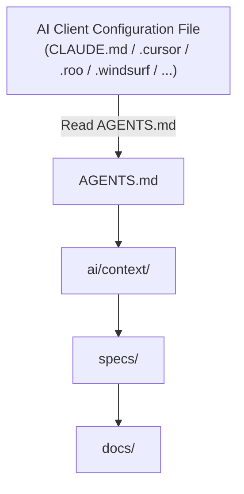

# Universal Project Structure for AI-First Development

> **Goal:** Create a universal project structure that works independently of the programming language and framework, in line with software development best practices. It should play well with various AI clients (Claude Code, Cursor, OpenCode, Cline, Roo Code, Codex CLI, Gemini CLI, Windsurf, Antigravity, and others) so that they can be used simultaneously or swapped in the future without the need to restructure the repository.

---

## Philosophy

A modern repository is no longer designed solely for human developers.

It is designed for:
- Developers
- AI Assistants
- AI Agents
- Code Review Agents
- DevOps Agents
- Test Agents
- Documentation

The biggest limitation of modern LLMs is not code generation, but **Context Management**.

**Overriding principle of context access:**
The repository has a single, completely shared structure for both humans and AI agents. Both parties use the same directories and files. Every file is an equal source of information for humans and AI alike — there are no "for humans" or "for AI" directories.

Therefore, a good project structure should:
- Minimize guessing by the AI,
- Be predictable,
- Have a single source of truth for each piece of information,
- Separate knowledge from implementation,
- Enable easily switching AI clients without reorganizing the repository.

**Rules for directory naming and knowledge organization:**
- Every directory in the repository must have a single, official name. Creating aliases, abbreviations, or alternative directory names in documentation or examples is prohibited.
- Directory names must be full and unambiguous (e.g., `config/` instead of `cfg/`, `infrastructure/` instead of `infra/`). Abbreviations are forbidden.
- These rules apply to the physical names of directories and files in the repository. Proper names of technologies in descriptions retain their official spelling.
- One knowledge category = one directory; one topic = one file.

---

## Core Principles

The five principles upon which the entire structure described in the rest of this document is built.

### 1. Single Source of Truth (SSOT)

Each piece of information exists in only one place.

Bad:

```txt
├── README
├── CLAUDE.md
├── .cursor/rules
├── AGENTS.md
└── docs/
```

with the architecture described everywhere.

Good:

```txt
├── docs/
└── ai/
```

and all other files simply refer back to these sources.

---

### 2. AI Should Not Guess

If a project has:
- Naming conventions,
- Architecture,
- Design decisions,
- Workflows,

they must be documented.

---

### 3. Small Files

AI analyzes much better when dealing with:
- Files of 100–300 lines,
- One responsibility per file,
- Small directories.

---

### 4. Documentation Close to Code

Code describes the implementation.

Documentation describes:
- Why,
- When,
- How.

---

### 5. Repository Must Be IDE-Independent

We do not want to rewrite documentation when changing AI tools. AI client configuration files (or the main rules files inside configuration directories, e.g., `.cursor/rules/main.mdc`) should contain at most 2–3 lines redirecting the model directly to `AGENTS.md`. Configuration files must not contain code examples or architecture descriptions.

---

## The Principle of Incremental Structure Growth

**Basic rule:** Every project starts with a minimal set of files and directories. New directories are added **only when a concrete, real need** arises — not according to a preset plan or target level. The structure grows directory by directory, alongside the actual needs of the project, and shrinks the same way when something is no longer needed.

**Starting structure — every project begins here:**

```txt
project/
├── .gitignore
├── AGENTS.md
├── MANIFEST.md
├── README.md
├── ai/
│   ├── context/
│   │   ├── project.md
│   │   └── structure-map.md
│   └── rules/
├── docs/
├── src/
└── tests/
```

Directories are added one at a time as the need arises. For example:
- `decisions/` — created when the first architectural decision worth recording appears
- `specs/` — created when the first feature requires documented business requirements
- `contracts/` — created when the project starts exposing APIs or exchanging data between modules

There is no "upgrade" from one level to another. There are no levels.

**How does the AI (and the human) know which directory to create and what to name it?**
This is governed by the [`ai/context/structure-map.md`](#aicontextstructure-mapmd) file — a full catalog of all possible, officially named directories described in this document, along with the conditions under which each directory should be created. Before creating a new top-level directory, the AI **must** consult `structure-map.md` instead of guessing the name or creating an alias (see: Rules for directory naming).

**What to do when a needed directory does not yet exist in the repository:**
1. Check `ai/context/structure-map.md` to see if there is an official name and definition for this directory.
2. If so, create the directory under that exact name, as described in this document, and add an entry in `MANIFEST.md`.
3. If the directory is not listed in `structure-map.md`, **do not create it on your own**. A new directory type is an architectural decision and must not be introduced based on AI guesswork — report the need to a human (e.g., as a task in `task.md` or as a direct question).
4. Any directory that is no longer needed (e.g., `prototypes/` after tests are completed) can be deleted or moved to `archive/` — the structure shrinks just as consciously as it grows.

---

## Detailed Description of Directories and Files

The following sections group all files and directories described in this document by their function: root files, the `ai/` directory, business/knowledge directories, implementation directories, and helper directories.

### Root Directory Files

Files located directly in the root of the repository — entry points and project metadata.

#### AGENTS.md

The most important file for AI agents.

**Acts purely as an Entry Point.** It must not contain any descriptions of architecture, technologies, design decisions, or summaries. Putting knowledge into the entry file violates the SSOT and leads to context pollution.

It should only contain:
- where the documentation is located,
- which rules apply,
- which workflows to use,
- what not to do.

**Minimal Template:**

```txt
Read first:
├── ai/context/project.md
├── ai/context/structure-map.md
├── ai/context/architecture.md

Follow:
├── ai/rules/coding.md

Use workflows:
├── ai/workflows/new-feature.md
```

**Prohibitions ("What not to do"):**
- Do not write business logic, code snippets, or system requirements directly in this file.
- Do not duplicate architecture descriptions or directory structures here (refer to `ai/context/` instead).
- Do not place tool-specific configurations (like `.cursorrules` content) inside this file; redirect them here instead.

We never duplicate knowledge.

---

#### MANIFEST.md

The map of the entire repository. This is the project's index — a list of what **currently exists** in the repository (in contrast to `ai/context/structure-map.md`, which describes everything that **could** exist).

`MANIFEST.md` contains only a list of directories and links to the relevant files — no descriptions. Using capitalized general names is prohibited.

**Minimal Template:**

```txt
├── [ai/context/](ai/context/)
├── [specs/](specs/)
├── [contracts/](contracts/)
├── [ai/workflows/](ai/workflows/)
├── [tests/](tests/)
├── [decisions/](decisions/)
├── [docs/](docs/)
```

This way, the AI does not have to search the entire repository.

---

#### README.md

Short. It should not replace documentation.

It should contain:
- project description,
- installation instructions,
- how to run the project,
- structure overview,
- link to documentation.

**Minimal Template:**

```md
# Project Name

A one-sentence description of the project.

## Installation
...

## How to Run
...

## Structure
See [MANIFEST.md](MANIFEST.md).

## Documentation
See [docs/](docs/) and [AGENTS.md](AGENTS.md) (for AI agents).
```

---

#### CHANGELOG.md

Change history.

**Minimal Template:**

```md
# CHANGELOG

## [Unreleased]

## [1.0.0] - 2026-01-01
### Added
- First version of the project.
```

---

#### ROADMAP.md

Development plan.

**Minimal Template:**

```md
# ROADMAP

## Now
- ...

## Next
- ...

## Later
- ...
```

---

#### task.md & tasks/

The single source of truth for the active task queue.

**Rules:**
- `task.md` — acts as the index and convention reference for the `tasks/` directory.
- `tasks/` — contains individual task files named `task-NNN-short-description.md`.
- `plans/` — only for epics and large changes, linked from `task.md` or individual task files.
- `ai/memory/` — strictly historical knowledge; no task lists allowed.
- Tasks can range from documentation changes, bugs, to new features, and are classified by status, priority, and type in their YAML frontmatter.

**Minimal Template (`tasks/task-001-example.md`):**

```md
---
id: task-001
status: todo          # todo | in_progress | blocked | review | done | cancelled
priority: medium      # low | medium | high | critical
type: docs            # docs | bug | feature | refactor | chore
owner: jan
created: 2026-07-07
updated: 2026-07-07
depends_on: []
---

# Task-001: Example Task Title

**Location:** ...

**Description:** ...

**Justification:** ...
```

---

#### LICENSE

The project license (e.g., MIT, Apache 2.0) in its standard, unmodified text, copied from the official license source.

---

#### .gitignore

The file controlling what is excluded from the repository.

**Must include:**
- `tmp/` — along with hidden AI tool logs (e.g., `.cursor-tutor`),
- build artifacts and dependencies specific to the tech stack.

The `tmp/` exclusion must also apply to CI/CD configuration, not just Git.

**Minimal Template:**

```txt
tmp/
.cursor-tutor
node_modules/
dist/
build/
*.log
.env
```

---

#### .github/

GitHub-specific configuration: CI/CD automation and collaboration templates.

```txt
├── workflows/
│   └── ci.yml
├── ISSUE_TEMPLATE.md
└── PULL_REQUEST_TEMPLATE.md
```

**Rule:** files in `.github/` do not contain business or architectural knowledge — CI/CD steps that require description refer back to `ai/workflows/` or `scripts/`.

---

### ai/ — AI Agents Directory

A directory containing instructions that govern the behavior of AI agents (rules, workflows, prompts, templates). The structure is shared between humans and AI — developers should look here to configure assistant behavior or learn about the project rules.

#### ai/context/

Project description.

```txt
├── project.md
├── structure-map.md
├── architecture.md
├── modules.md
├── stack.md
└── glossary.md
```

Contains:
- project goal,
- modules,
- architecture,
- technologies,
- glossary,
- map of possible directory structure.

**SSOT Rule:** Files in `ai/context/` act as *entry points* and can only contain:
- high-level goals,
- Markdown links to the actual files in `docs/`, `config/`, `decisions/`.

Strict prohibition against duplicating or summarizing technical descriptions found in `docs/`, `config/`, or `decisions/`. No technical diagrams — those belong in `docs/`.

**Minimal Template (`project.md`):**

```md
# Project Name

## Goal
One sentence / short paragraph — why the project exists.

## Related
- [architecture.md](architecture.md)
- [modules.md](modules.md)
- [structure-map.md](structure-map.md)
```

##### ai/context/structure-map.md

Key file supporting the **incremental structure growth principle**. A full, flat catalog of all directories described in this document (superset of MINIMAL + FULL), along with the conditions under which each directory should be created in a specific project. This is the only place the AI checks before creating a new top-level directory.

**Minimal Template:**

| Directory | When to create |
|---|---|
| `specs/` | when the first feature requiring documented business requirements is introduced |
| `decisions/` | when the first architectural decision worth justifying arises |
| `contracts/` | when the project starts exposing APIs or exchanging data between modules |
| `knowledge/` | when business knowledge grows too large to fit in a single `glossary.md` |
| `checklists/` | when a repeatable process (e.g., release) begins to be executed manually more than once |
| `plans/` | when the first change too large for a single entry in `task.md` is introduced |
| `prototypes/` | when the team starts testing solutions not intended for immediate production release |
| `archive/` | when the first piece of code or documentation becomes inactive but is worth preserving |
| `research/` | when the team begins analytical research, spikes, or market/competitor analysis |
| `tools/` | when custom utilities, generators, converters, or CLIs are created for the project |
| `scripts/` | when automation or helper scripts (build, seed, deploy, backup) are introduced |
| `config/` | when tool configs (eslint, tsconfig, vite, etc.) are consolidated to reduce root directory clutter |
| `infrastructure/` | when DevOps/IAC resources (docker-compose, terraform, helm, kubernetes) are introduced |
| `assets/` | when static assets (images, icons, fonts, design documents) are added to the project |
| `examples/` | when documentation references usage examples or code snippets (e.g., API requests/responses) |
| `tasks/` | when tasks start being managed via individual markdown files with YAML frontmatter |
| `tmp/` | created automatically by local tools or build processes for temporary files |

---

#### ai/rules/

Rules and conventions governing the AI.

Files in this directory must contain only rules and conventions, **not** procedural steps. Step-by-step procedures belong exclusively in `ai/workflows/`.

```txt
├── coding.md
├── testing.md
├── git.md
├── security.md
└── review.md
```

**Minimal Template (`coding.md`):**

```txt
Maximum file 300 lines

Maximum function 40 lines

Use Composition

No Business Logic in Controllers
```

---

#### ai/workflows/

Operational procedures containing **universal step-by-step procedures executed by both humans and AI**. Workflows must be atomic and deterministic.

```txt
├── new-feature.md
├── bugfix.md
├── refactor.md
├── release.md
├── rollback.md
├── incident.md
├── production-hotfix.md
└── onboarding.md
```

**Minimal Template (`new-feature.md`):**

```md
# Workflow: New Feature

1. Read the requirements in `specs/<feature>/requirements.md`.
2. Check the associated contract in `contracts/`, if it exists.
3. Implement according to `ai/rules/coding.md`.
4. Add tests in `tests/`.
5. Update `CHANGELOG.md`.
```

---

#### ai/prompts/

Ready-to-use, **generic prompts manually triggered by the user**. This directory is used exclusively to store such prompts.

**Rules:**
- Files in `ai/prompts/` must not contain rules like "always", "never", "must".
- System instructions belong in `ai/rules/` or `ai/workflows/` — not in `ai/prompts/`.

```txt
├── create-api.md
├── review.md
├── debug.md
└── migration.md
```

**Minimal Template (`create-api.md`):**

```md
Context: {short description of the feature}
Requirements: in accordance with ai/rules/coding.md and contracts/{name}.yaml
Task: generate controller, service, and unit tests.
```

---

#### ai/templates/

Code templates, organized by pattern name as subdirectories and tech-stack as individual files.

```txt
├── service/
│   ├── python.md
│   └── typescript.md
├── controller/
│   └── typescript.md
├── repository/
│   └── python.md
├── migration/
├── component/
└── endpoint/
```

**Rule:** Template directories represent the pattern or architectural role (e.g., `service/`, `controller/`), and the files inside represent the specific technology or language stack (e.g., `python.md`, `typescript.md`, `go.md`).

---

#### ai/memory/

Project historical memory. Used exclusively to store historical knowledge.

```txt
├── known-problems.md
├── technical-debt.md
└── lessons-learned.md
```

**Rule:** The `ai/memory/` directory stores only historical knowledge (e.g., known issues, technical debt, lessons learned). Placing current tasks, plans, or active issues there is prohibited. The active task queue belongs solely to `task.md`.

**Minimal Template (`known-problems.md`):**

```md
# Known Problems

## [2026-01-15] Race condition in the cache layer
**Status:** open
**Description:** ...
**Workaround:** ...
```

---

### Business and Knowledge Directories

Directories describing requirements, decisions, and domain knowledge — separated from implementation.

#### specs/

The most important business directory. Describes **business requirements and acceptance criteria**.

Not implementation.

```txt
└── authentication/
    ├── requirements.md
    ├── acceptance.md
    └── api.md
```

**Rules:**
- The `specs/` directory must not contain any task lists. Tasks must be located exclusively in `task.md` or the `tasks/` directory.
- Files in `specs/` must not contain data tables or field definitions — those belong in `contracts/`.
- `specs/` links to `contracts/` without duplicating fields.

AI implements features much better when specifications are provided.

**Minimal Template (`requirements.md`):**

```md
# Requirements: Authentication

## Business Goal
...

## Requirements
- REQ-1: ...
- REQ-2: ...

## Associated Contract
[contracts/auth.yaml](../../contracts/auth.yaml)
```

**Minimal Template (`acceptance.md`):**

```md
# Acceptance Criteria: Authentication

- [ ] User logs in with email and password
- [ ] Incorrect password returns message X
```

---

#### knowledge/

The domain and business knowledge of the project. The directory contains information describing the domain, business processes, users, and legal requirements. It does not store technical or implementation documentation — those belong in `docs/` and `src/` respectively.

Each knowledge category is represented by a separate subdirectory. Individual issues should be recorded as small, independent Markdown files according to the principle: **one category = one directory, one topic = one file**.

```txt
knowledge/
├── business/
├── faq/
├── terminology/
├── edge-cases/
├── legal/
└── personas/
```

**Description of subdirectories:**
- **`business/`** — knowledge about business processes, operational models, business rules, and domain logic. Each process or business area should be described in a separate file.
- **`faq/`** — frequently asked questions and answers. It is recommended to group questions by topic (e.g., authentication, payments, integrations) rather than creating one large document.
- **`terminology/`** — a glossary of business terms used in the project. Each term should reside in a separate file containing an unambiguous definition and links to related concepts. Do not place technical terms from the technology stack here — those belong in `ai/context/stack.md` and `ai/context/glossary.md`.
- **`edge-cases/`** — descriptions of unusual business scenarios, exceptions, and special cases that do not directly stem from the main process flow but must be handled during implementation.
- **`legal/`** — legal, regulatory, and compliance requirements affecting the project (e.g., GDPR, data retention, security policies, industry-specific regulations).
- **`personas/`** — user personas of the system. Each persona should be described in a separate file (e.g., `anna.md`, `administrator.md`, `accountant.md`) detailing goals, needs, limitations, permissions, and typical usage scenarios.

**SSOT Rule:** `knowledge/` is the single source of truth for domain knowledge. Technical documentation belongs in `docs/`, requirements in `specs/`, architectural decisions in `decisions/`, and technology stack information in `ai/context/`.

**Minimal Template (`terminology.md`):**

```md
# Terminology

## Order
A transaction initiated by a customer, consisting of at least one line item.

## Underwriting
The process of assessing risk preceding the acceptance of a policy.
```

---

#### checklists/

Checklists verifying the correct execution of specific tasks.

```txt
├── review.md
├── release.md
├── security.md
└── testing.md
```

Checklists define concise verification criteria (e.g., what to check before a release), whereas full step-by-step procedures reside in `ai/workflows/`. AI is excellent at automated checklist verification.

**Minimal Template (`release.md`):**

```md
# Checklist: Release

- [ ] All tests pass
- [ ] `CHANGELOG.md` is updated
- [ ] Version number is bumped
```

---

#### decisions/

Architecture Decision Records (ADR).

```txt
├── 001-postgres.md
├── 002-events.md
└── 003-auth.md
```

We describe:
- the decision,
- the rationale,
- alternatives,
- consequences.

AI does not guess why something was chosen.

**Minimal Template:**

```md
# ADR 001: Selection of PostgreSQL

## Status
Accepted

## Decision
...

## Rationale
...

## Alternatives
...

## Consequences
...
```

---

#### contracts/

Formal API schemas and data structures.

```txt
├── openapi.yaml
├── json-schema.json
├── schema.graphql
├── events.yaml
└── grpc/
    └── service.proto
```

**Rule:** `contracts/` contains formal API schemas and data structures. `specs/` describes business requirements and acceptance criteria, linking to `contracts/` without duplicating fields.

AI does not guess data structures.

**Minimal Template (OpenAPI snippet):**

```yaml
openapi: 3.0.0
paths:
  /users:
    get:
      summary: List users
      responses:
        '200':
          description: OK
```

---

#### docs/

Technical, system, and architectural documentation of the project. It is intended to be read by developers and AI to understand the technical context of the system.

```txt
├── architecture/
├── database/
├── deployment/
├── api/
├── security/
└── testing/
```

**Rule:** Documentation should focus on explaining *why*, *when*, and *how*, rather than duplicating source code. Code examples, templates, and configurations belong in `examples/`, `ai/templates/`, or `config/`.

**Minimal Template (`architecture/payments.md`):**

```md
# Architecture: Payments Module

## Context
...

## Decisions
See [decisions/](../../decisions/).

## Diagram
(diagram or link)
```

---

### Implementation Directories

Directories containing code, tests, and technical configuration of the project.

#### src/

Application code. The `src/` directory can only contain source code. Documentation files (`.md`) are prohibited and must reside in `docs/`, `knowledge/`, or `ai/context/`.

---

#### tests/

Tests.

Ideally structured analogously to `src/`.

---

#### config/

The complete project configuration. The `config/` directory is the central repository for configuration. If tooling requires a file in the root directory, place a minimal file (max. 5 lines) there extending the configuration from `config/` or use a symlink.

```txt
├── eslint
├── prettier
├── tsconfig
├── vite
├── webpack
├── nginx
└── docker
```

**Minimal Template (file in root extending `config/`):**

```json
{ "extends": "./config/tsconfig/base.json" }
```

---

#### scripts/

Automation scripts.

```txt
├── build
├── release
├── backup
├── seed
├── lint
├── generate
└── migration
```

**Minimal Template (script header):**

```bash
#!/usr/bin/env bash
set -euo pipefail
# Purpose: brief description of what the script does
```

---

#### infrastructure/

DevOps resources.

```txt
├── docker/
├── terraform/
├── helm/
├── kubernetes/
└── ansible/
```

---

#### tools/

Helper utilities.

```txt
├── generator
├── cli
├── parser
└── converter
```

---

### Supporting Directories

Supporting directories, not required in the MINIMAL version — created in accordance with the incremental growth principle.

#### examples/

Usage examples and code snippets referenced by the documentation.

```txt
├── request.json
├── response.json
├── webhook.json
└── event.json
```

LLMs learn very well from examples (Few-Shot Learning).

---

#### plans/

Plans for major changes (epics and large migrations), linked from `task.md`.

```txt
├── migration.md
├── refactor.md
└── caching.md
```

**Minimal Template:**

```md
# Plan: Migration to Microservices

## Goal
...

## Phases
1. ...
2. ...

## Risks
...
```

---

#### prototypes/

Prototypes.

```txt
├── rag/
├── llm/
├── sandbox/
└── benchmarks/
```

We do not mix them with production.

**Minimal Template:**

```md
# Prototype: Reranking in RAG

## Hypothesis
...

## Result
...

## Decision
continue / abandon
```

---

#### research/

Analytical materials, benchmarks, market research, user interviews, and spikes leading to design decisions.
`research/` is not a source of active requirements or decisions. Research results are subsequently migrated to `specs/` or `decisions/`.

```txt
research/
├── market/
├── competitors/
├── users/
├── benchmarks/
├── spikes/
└── experiments/
```

---

#### archive/

Historical code and docs.

```txt
├── legacy/
├── deprecated/
└── old-docs/
```

Helps AI distinguish active code from obsolete files.

---

#### assets/

Static assets.

```txt
├── images/
├── icons/
├── fonts/
├── documents/
└── design/
```

---

#### tmp/

Temporary files. AI often generates temporary files — they should not end up in `src/`.

**Rule:** The `tmp/` directory must be ignored in `.gitignore` (see section above) — do not duplicate the list here.

---

## Terminology Management

**Distinction between categories of terms:**
- **Technical term** — a concept from the technology stack, design pattern, or system structure, independent of the customer's domain (e.g., "Repository", "Feature flag", "Middleware").
- **Business term** — a domain concept specific to the industry or customer, understandable by non-technical people (e.g., "Underwriting", "Completed order", "VIP client").

**Rules (applied incrementally as the project grows):**
- As long as `knowledge/terminology/` does not yet exist in the project, `ai/context/glossary.md` stores both business and technical terms and must be self-sufficient.
- Once business knowledge grows large enough to warrant a dedicated `knowledge/terminology/` directory, business terms migrate there. `ai/context/glossary.md` then contains only technical terms.
- If a technical term in `glossary.md` is closely tied to a business concept, the entry can link to the relevant definition in `knowledge/terminology/` instead of repeating it, e.g., `[Order](../../knowledge/terminology/order.md)`.
- At all times: `ai/context/glossary.md` must contain single-sentence definitions.

---

## Integration with AI Clients

AI client configuration files should contain **at most 2–3 lines** directing the model directly to `AGENTS.md`. Configuration files must not contain code examples or business knowledge.

Examples of configuration files:

```txt
├── AGENTS.md
├── CLAUDE.md
├── .cursor/rules/main.mdc
├── .clinerules
├── .roo/rules.md
├── .windsurf/rules.md
└── .github/copilot-instructions.md
```

**Rule:**
- None of these files should contain business or architectural knowledge.
- They should only point to the location of the documentation (max. 2–3 lines).
- If the AI client requires a configuration directory (e.g., `.cursor/`, `.roo/`, `.windsurf/`), the 2–3 lines rule applies to the main rules file inside that directory — the directory itself is not a file and is not directly subject to the line limit.

Information flow:



As a result, changing the IDE does not require rewriting the documentation.

---

## Best Practices for AI

| Principle | Benefit |
|----------|----------|
| One responsibility per file | Easier analysis by AI |
| Short files (100–300 lines) | Reduced context consumption |
| Predictable names | AI finds information faster |
| Documentation close to code | Easier understanding of the project |
| ADR (`decisions/`) | AI understands architectural decisions |
| `specs/` | AI implements requirements instead of guessing |
| `contracts/` | No guesswork regarding data structures |
| `examples/` | Few-Shot Learning improves response quality |
| `checklists/` | Repeatable processes and fewer errors |
| `ai/workflows/` | Ready operational procedures for humans and AI |
| `ai/rules/` | Code consistency across sessions |
| `ai/memory/` | Retention of historical project knowledge |
| `ai/context/structure-map.md` | AI knows when and what directory to create instead of guessing |
| `MANIFEST.md` | AI quickly finds the correct files |
| `AGENTS.md` | A single entry point for all agents |

---

## Summary

A modern **AI-First** repository should separate responsibilities into four main areas:

| Area | Purpose |
|----------|----------------|
| **Code (`src/`)** | Application implementation |
| **Documentation (`docs/`, `knowledge/`, `specs/`)** | Knowledge and description of business requirements |
| **AI Context (`ai/`)** | Rules, workflows, historical memory, templates, and prompts |
| **AI Tool Integration (`AGENTS.md`, `CLAUDE.md`, `.cursor/`, `.github/copilot-instructions.md`, etc.)** | Thin layer (max. 2–3 lines) pointing to where the proper context resides, without duplicating knowledge |

A structure designed this way:
- is independent of the programming language and framework,
- works with most modern AI clients,
- makes it easy to change tools without migrating documentation,
- minimizes errors due to loss of context,
- ensures consistency in the work of humans and AI agents,
- grows incrementally, directory by directory, instead of forcing one of three rigid variants,
- scales from small applications to large multi-module systems.
