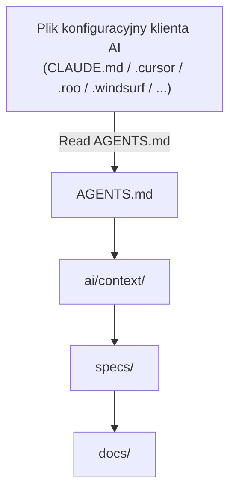

# Uniwersalna struktura projektu dla AI-First Development

> **Cel:** stworzenie uniwersalnej struktury projektu, która działa niezależnie od języka programowania i frameworka, zgodnie z najlepszymi praktykami rozwoju oprogramowania. Działająca dobrze z klientami AI (Claude Code, Cursor, OpenCode, Cline, Roo Code, Codex CLI, Gemini CLI, Windsurf, Antigravity i innymi), tak aby można z nich było korzystać równocześnie lub zmieniać je w przyszłości bez konieczności przebudowy repozytorium.

---

## Filozofia

Nowoczesne repozytorium nie jest już projektowane wyłącznie dla programisty.

Jest projektowane dla:
- Programisty
- AI Assistant
- AI Agent
- Code Review Agent
- DevOps Agent
- Test Agent
- Dokumentacji

Największym ograniczeniem współczesnych modeli LLM nie jest generowanie kodu, ale **zarządzanie kontekstem (Context Management)**.

**Nadrzędna zasada dostępu do kontekstu:**
Repozytorium posiada jedną, całkowicie wspólną strukturę dla człowieka oraz agentów AI. Obie strony korzystają z tych samych katalogów i plików. Każdy plik jest równorzędnym źródłem informacji dla człowieka i AI — nie istnieją katalogi „dla ludzi" ani „dla AI".

Dlatego dobra struktura projektu powinna:
- minimalizować zgadywanie przez AI,
- być przewidywalna,
- mieć jedną lokalizację dla każdej informacji,
- rozdzielać wiedzę od implementacji,
- umożliwiać łatwą zmianę klienta AI bez przebudowy repozytorium.

**Zasady nazewnictwa katalogów i organizacji wiedzy:**
- Każdy katalog w repozytorium musi posiadać jedną, oficjalną nazwę. Zakaz tworzenia aliasów, skrótów lub alternatywnych nazw katalogów w dokumentacji lub przykładach.
- Nazwy katalogów muszą być pełne i jednoznaczne (np. `config/` zamiast `cfg/`, `infrastructure/` zamiast `infra/`). Skróty są zabronione.
- Reguły dotyczą fizycznych nazw katalogów i plików repozytorium. Nazwy własne technologii w opisach zachowują oficjalną pisownię.
- Jedna kategoria wiedzy = jeden katalog, jedno zagadnienie = jeden plik.

---

## Najważniejsze zasady

Pięć zasad, na których opiera się cała struktura opisana w dalszej części dokumentu.

### 1. Single Source of Truth (SSOT)

Każda informacja występuje tylko w jednym miejscu.

Źle:

```txt
├── README
├── CLAUDE.md
├── .cursor/rules
├── AGENTS.md
└── docs/
```

wszędzie opis architektury.

Dobrze:

```txt
├── docs/
└── ai/
```

a wszystkie pozostałe pliki jedynie odwołują się do tych źródeł.

---

### 2. AI nie powinno zgadywać

Jeżeli projekt posiada:
- konwencje nazewnictwa,
- architekturę,
- decyzje projektowe,
- workflow,

to powinny być zapisane.

---

### 3. Małe pliki

AI dużo lepiej analizuje:
- pliki 100–300 linii,
- jedną odpowiedzialność na plik,
- małe katalogi.

---

### 4. Dokumentacja blisko kodu

Kod opisuje implementację.

Dokumentacja opisuje:
- dlaczego,
- kiedy,
- jak.

---

### 5. Repozytorium ma być niezależne od IDE

Nie chcemy przepisywać dokumentacji przy zmianie narzędzia AI. Pliki konfiguracyjne klientów AI powinny zawierać maksymalnie 2–3 linie odsyłające model bezpośrednio do `AGENTS.md`. Pliki konfiguracyjne nie mogą zawierać przykładów kodu ani opisów architektury.

---

## Zasada przyrostowego wzrostu struktury

Poziomy **MINIMAL / OPTIMAL / FULL** opisane w kolejnej sekcji mają charakter **wyłącznie poglądowy**. Pokazują typowe migawki struktury na różnych etapach życia projektu — nie są to sztywne warianty, spośród których wybiera się jeden na starcie.

**Zasada bazowa:**
- Każdy projekt zaczyna od struktury **MINIMAL**.
- Kolejny katalog jest dodawany **wyłącznie wtedy, gdy pojawia się konkretna, realna potrzeba** jego istnienia — np. `decisions/` powstaje w momencie, gdy trzeba zapisać pierwszy ADR, a nie prewencyjnie „bo tak jest w OPTIMAL".
- Struktura nigdy nie „przeskakuje" jako całość do OPTIMAL lub FULL — rośnie katalog po katalogu, wraz z realnymi potrzebami projektu.

**Skąd AI (i człowiek) wie, jaki katalog utworzyć i jak go nazwać?**
Służy do tego plik [`ai/context/structure-map.md`](#aicontextstructure-mapmd) — pełny katalog wszystkich możliwych, oficjalnie nazwanych katalogów opisanych w tym dokumencie, wraz z warunkiem, kiedy dany katalog powinien powstać. Przed utworzeniem nowego katalogu najwyższego poziomu AI **musi** sprawdzić `structure-map.md`, zamiast zgadywać nazwę lub tworzyć alias (patrz: Zasady nazewnictwa katalogów).

**Postępowanie, gdy potrzebny katalog jeszcze nie istnieje w repozytorium:**
1. Sprawdź `ai/context/structure-map.md` — czy istnieje oficjalna nazwa i definicja tego katalogu.
2. Jeśli tak — utwórz katalog dokładnie pod tą nazwą, zgodnie z opisem w tym dokumencie, i dodaj wpis w `MANIFEST.md`.
3. Jeśli katalogu nie ma w `structure-map.md` — **nie twórz go samodzielnie**. Nowy typ katalogu to decyzja architektoniczna, nie może powstać przez domysł AI — zgłoś potrzebę człowiekowi (np. jako wpis w `TODO.md` lub bezpośrednie pytanie).
4. Katalog, który przestał być potrzebny (np. `experiments/` po zakończeniu eksperymentów), może zostać usunięty lub przeniesiony do `archive/` — struktura kurczy się tak samo świadomie, jak rośnie.

---

## Migawki struktury (poglądowe)

Trzy przykładowe stany struktury na różnych etapach wzrostu projektu — zgodnie z zasadą przyrostowego wzrostu opisaną powyżej. Żaden z nich nie jest docelowym „poziomem" do wybrania na starcie.

### Wersja MINIMAL (podstawowa)

Punkt startowy każdego projektu, bez wyjątku.

```txt
project/
├── AGENTS.md
├── README.md
├── ai/
│   ├── context/
│   └── rules/
├── docs/
├── src/
└── tests/
```

---

### Wersja OPTIMAL (zalecana)

Typowy stan projektu średniej wielkości, osiągnięty przyrostowo z MINIMAL.

```txt
project/
├── AGENTS.md
├── MANIFEST.md
├── README.md
├── CHANGELOG.md
├── ROADMAP.md
├── TODO.md
├── LICENSE
├── ai/
│   ├── context/
│   ├── rules/
│   ├── workflows/
│   ├── prompts/
│   ├── templates/
│   └── memory/
├── specs/
├── docs/
├── decisions/
├── contracts/
├── src/
├── tests/
├── config/
├── scripts/
├── infrastructure/
├── tools/
├── examples/
├── assets/
├── .github/
├── .gitignore
└── tmp/
```

---

### Wersja FULL (AI Native)

Stan dużego, dojrzałego projektu wielomodułowego.

```txt
project/
├── AGENTS.md
├── MANIFEST.md
├── README.md
├── CHANGELOG.md
├── ROADMAP.md
├── TODO.md
├── LICENSE
├── ai/
│ ├── context/
│ ├── rules/
│ ├── workflows/
│ ├── prompts/
│ ├── templates/
│ └── memory/
├── specs/
├── knowledge/
│ ├── business/
│ ├── faq/
│ ├── terminology/
│ ├── edge-cases/
│ ├── legal/
│ └── personas/
├── checklists/
├── decisions/
├── contracts/
│ ├── openapi.yaml
│ ├── json-schema.json
│ ├── schema.graphql
│ ├── events.yaml
│ └── grpc/
│ └── service.proto
├── docs/
├── research/
│ ├── market/
│ ├── competitors/
│ ├── users/
│ ├── benchmarks/
│ ├── spikes/
│ └── experiments/
├── src/
├── tests/
├── infrastructure/
│ ├── docker/
│ ├── terraform/
│ ├── helm/
│ ├── kubernetes/
│ └── ansible/
├── config/
├── scripts/
├── tools/
├── examples/
├── plans/
├── experiments/
│ ├── rag/
│ ├── llm/
│ ├── prototypes/
│ └── benchmarks/
├── archive/
├── assets/
│ ├── images/
│ ├── icons/
│ ├── fonts/
│ ├── documents/
│ └── design/
├── .github/
├── .gitignore
└── tmp/

```

---

## Szczegółowy opis katalogów i plików

Poniższe podrozdziały grupują wszystkie pliki i katalogi opisane w tym dokumencie wg ich funkcji: pliki root, katalog `ai/`, katalogi biznesowe/wiedzy, katalogi implementacyjne oraz katalogi pomocnicze.

### Pliki katalogu głównego (root)

Pliki znajdujące się bezpośrednio w korzeniu repozytorium — punkty wejścia i metadane projektu.

#### AGENTS.md

Najważniejszy plik dla agentów AI.

**Pełni wyłącznie rolę punktu wejścia (Entry Point).** Nie może zawierać żadnych opisów architektury, technologii, decyzji projektowych ani streszczeń. Umieszczanie wiedzy w pliku wejściowym łamie SSOT i prowadzi do nadpisywania kontekstu.

Powinien zawierać jedynie:
- gdzie znajduje się dokumentacja,
- jakie reguły obowiązują,
- jakie workflow stosować,
- czego nie robić.

**Minimalny szablon:**

```txt
Read first:
├── ai/context/project.md
├── ai/context/structure-map.md
├── ai/context/architecture.md

Follow:
├── ai/rules/coding.md

Use workflows:
├── ai/workflows/new-feature.md
```

Nigdy nie duplikujemy wiedzy.

---

#### MANIFEST.md

Mapa całego repozytorium. To indeks projektu — lista tego, co **aktualnie istnieje** w repozytorium (w odróżnieniu od `ai/context/structure-map.md`, który opisuje wszystko, co **może** powstać).

`MANIFEST.md` zawiera wyłącznie listę katalogów i linki do właściwych plików — bez opisów. Zakaz używania nazw ogólnych pisanych wielką literą.

**Minimalny szablon:**

```txt
├── [ai/context/](ai/context/)
├── [specs/](specs/)
├── [contracts/](contracts/)
├── [ai/workflows/](ai/workflows/)
├── [tests/](tests/)
├── [decisions/](decisions/)
├── [docs/](docs/)
```

Dzięki temu AI nie musi przeszukiwać całego repozytorium.

---

#### README.md

Krótki. Nie powinien zastępować dokumentacji.

Powinien zawierać:
- opis projektu,
- instalację,
- uruchomienie,
- strukturę,
- link do dokumentacji.

**Minimalny szablon:**

```md
# Nazwa projektu

Jednozdaniowy opis projektu.

## Instalacja
...

## Uruchomienie
...

## Struktura
Zobacz [MANIFEST.md](MANIFEST.md).

## Dokumentacja
Zobacz [docs/](docs/) i [AGENTS.md](AGENTS.md) (dla agentów AI).
```

---

#### CHANGELOG.md

Historia zmian.

**Minimalny szablon:**

```md
# CHANGELOG

## [Unreleased]

## [1.0.0] - 2026-01-01
### Added
- Pierwsza wersja projektu.
```

---

#### ROADMAP.md

Plan rozwoju.

**Minimalny szablon:**

```md
# ROADMAP

## Teraz
- ...

## Następne
- ...

## Później
- ...
```

---

#### TODO.md

Jedyne miejsce na aktywną kolejkę zadań.

**Zasady:**
- `TODO.md` — jedyne miejsce na aktywną kolejkę zadań.
- `plans/` — wyłącznie epiki i duże zmiany, linkowane z `TODO.md`.
- `ai/memory/` — wyłącznie wiedza historyczna, zakaz list zadań.
- `TODO.md` nie może zawierać zadań technicznych typu „naprawić bug" — te należą do systemu ticketów lub `plans/`.

**Minimalny szablon:**

```md
# TODO

## W trakcie
- [ ] Zadanie 1

## Do zrobienia
- [ ] Zadanie 2

## Zablokowane
- [ ] Zadanie 3 — czeka na decyzję: patrz [decisions/](decisions/)
```

---

#### LICENSE

Licencja projektu (np. MIT, Apache 2.0), w standardowym, niezmodyfikowanym brzmieniu, kopiowana z oficjalnego źródła licencji.

---

#### .gitignore

Plik kontrolujący, co nie trafia do repozytorium.

**Musi zawierać wykluczenie:**
- `tmp/` — wraz z ukrytymi logami narzędzi AI (np. `.cursor-tutor`),
- artefaktów builda i zależności specyficznych dla stosu technologicznego.

Wykluczenie `tmp/` musi obowiązywać także w konfiguracji CI/CD, nie tylko w Git.

**Minimalny szablon:**

```txt
tmp/
.cursor-tutor
node_modules/
dist/
build/
*.log
.env
```

---

#### .github/

Konfiguracja specyficzna dla GitHub: automatyzacja CI/CD oraz szablony współpracy.

```txt
├── workflows/
│   └── ci.yml
├── ISSUE_TEMPLATE.md
└── PULL_REQUEST_TEMPLATE.md
```

**Zasada:** pliki w `.github/` nie zawierają wiedzy biznesowej ani architektonicznej — kroki CI/CD wymagające opisu odsyłają do `ai/workflows/` lub `scripts/`.

---

### ai/ — katalog agentów AI

Katalog zawierający instrukcje sterujące zachowaniem agentów AI (reguły, przepływy pracy, prompty, szablony). Struktura jest wspólna dla człowieka i AI — programiści powinni tu zaglądać, aby konfigurować zachowanie asystentów lub zapoznać się z regułami.

#### ai/context/

Opis projektu.

```txt
├── project.md
├── structure-map.md
├── architecture.md
├── modules.md
├── stack.md
└── glossary.md
```

Zawiera:
- cel projektu,
- moduły,
- architekturę,
- technologie,
- słownik pojęć,
- mapę możliwej struktury katalogów.

**Zasada SSOT:** Pliki w `ai/context/` pełnią funkcję *punktów wejścia* i mogą zawierać wyłącznie:
- cele wysokiego poziomu,
- linki Markdown do właściwych plików w `docs/`, `config/`, `decisions/`.

Bezwzględny zakaz powielania lub streszczania opisów technicznych znajdujących się w `docs/`, `config/`, `decisions/`. Zero diagramów technicznych — te należą do `docs/`.

**Minimalny szablon (`project.md`):**

```md
# Nazwa projektu

## Cel
Jedno zdanie / krótki akapit — po co istnieje projekt.

## Powiązane
- [architecture.md](architecture.md)
- [modules.md](modules.md)
- [structure-map.md](structure-map.md)
```

##### ai/context/structure-map.md

Kluczowy plik wspierający **zasadę przyrostowego wzrostu struktury**. Pełny, płaski katalog wszystkich katalogów opisanych w niniejszym dokumencie (superzbiór MINIMAL + OPTIMAL + FULL), wraz z warunkiem, kiedy dany katalog powinien zostać utworzony w konkretnym projekcie. To jedyne miejsce, które AI sprawdza przed utworzeniem nowego katalogu najwyższego poziomu.

**Minimalny szablon:**

```md
| Katalog | Kiedy utworzyć |
|---|---|
| `specs/` | gdy pojawia się pierwsza funkcjonalność wymagająca spisania wymagań biznesowych |
| `decisions/` | gdy pojawia się pierwsza decyzja architektoniczna warta uzasadnienia |
| `contracts/` | gdy projekt zaczyna eksponować API lub wymieniać dane między modułami |
| `knowledge/` | gdy wiedza biznesowa przestaje mieścić się w jednym `glossary.md` |
| `checklists/` | gdy powtarzalny proces (np. release) zaczyna być wykonywany ręcznie więcej niż raz |
| `plans/` | gdy pojawia się pierwsza zmiana zbyt duża na jeden wpis w `TODO.md` |
| `experiments/` | gdy zespół zaczyna testować rozwiązania nieprzeznaczone od razu na produkcję |
| `archive/` | gdy pierwszy fragment kodu lub dokumentacji staje się nieaktywny, ale wart zachowania |
```

---

#### ai/rules/

Reguły i konwencje obowiązujące AI.

Pliki w tym katalogu mogą zawierać wyłącznie reguły i konwencje, a **nie** kroki proceduralne. Procedury krok po kroku należą wyłącznie do `ai/workflows/`.

```txt
├── coding.md
├── testing.md
├── git.md
├── security.md
└── review.md
```

**Minimalny szablon (`coding.md`):**

```txt
Maximum file 300 lines

Maximum function 40 lines

Use Composition

No Business Logic in Controllers
```

---

#### ai/workflows/

Procedury operacyjne zawierające **uniwersalne procedury krok po kroku wykonywane przez ludzi i AI**. Workflowy muszą być atomowe i deterministyczne.

```txt
├── new-feature.md
├── bugfix.md
├── refactor.md
├── release.md
├── rollback.md
├── incident.md
├── production-hotfix.md
└── onboarding.md
```

**Minimalny szablon (`new-feature.md`):**

```md
# Workflow: Nowa funkcjonalność

1. Przeczytaj wymagania w `specs/<feature>/requirements.md`.
2. Sprawdź powiązany kontrakt w `contracts/`, jeśli istnieje.
3. Zaimplementuj zgodnie z `ai/rules/coding.md`.
4. Dodaj testy w `tests/`.
5. Zaktualizuj `CHANGELOG.md`.
```

---

#### ai/prompts/

Gotowe, **generyczne prompty ręcznie wywoływane przez użytkownika**. Katalog służy wyłącznie do przechowywania takich promptów.

**Zasady:**
- Pliki w `ai/prompts/` nie mogą zawierać reguł typu „always", „never", „must".
- Instrukcje systemowe należą do `ai/rules/` lub `ai/workflows/` — nie do `ai/prompts/`.

```txt
├── create-api.md
├── review.md
├── debug.md
└── migration.md
```

**Minimalny szablon (`create-api.md`):**

```md
Kontekst: {krótki opis funkcjonalności}
Wymagania: zgodnie z ai/rules/coding.md oraz contracts/{nazwa}.yaml
Zadanie: wygeneruj kontroler, serwis i testy jednostkowe.
```

---

#### ai/templates/

Szablony.

```txt
├── service
├── controller
├── repository
├── migration
├── component
└── endpoint
```

*(Uwaga: forma nazw plików/podkatalogów w tym katalogu wymaga jeszcze doprecyzowania — do ustalenia osobno.)*

---

#### ai/memory/

Pamięć historyczna projektu. Służy wyłącznie do przechowywania wiedzy historycznej.

```txt
├── known-problems.md
├── technical-debt.md
└── lessons-learned.md
```

**Zasada:** Katalog `ai/memory/` przechowuje wyłącznie wiedzę historyczną (np. znane problemy, dług techniczny, lessons learned). Zakaz umieszczania tam aktualnych zadań, planów lub bieżących problemów. Aktywna kolejka zadań należy wyłącznie do `TODO.md`.

**Minimalny szablon (`known-problems.md`):**

```md
# Known Problems

## [2026-01-15] Race condition w warstwie cache
**Status:** otwarty
**Opis:** ...
**Obejście:** ...
```

---

### Katalogi biznesowe i wiedzy

Katalogi opisujące wymagania, decyzje i wiedzę domenową — oddzielone od implementacji.

#### specs/

Najważniejszy katalog biznesowy. Opisuje **wymagania biznesowe i kryteria akceptacji**.

Nie implementację.

```txt
└── authentication/
    ├── requirements.md
    ├── acceptance.md
    └── api.md
```

**Zasady:**
- Katalog `specs/` nie może zawierać żadnych list zadań. Zadania muszą znajdować się wyłącznie w `TODO.md`.
- Pliki w `specs/` nie mogą zawierać tabel danych ani definicji pól — te należą do `contracts/`.
- `specs/` odwołuje się linkami do `contracts/`, bez powielania pól.

AI znacznie lepiej implementuje funkcjonalność posiadając specyfikację.

**Minimalny szablon (`requirements.md`):**

```md
# Wymagania: Uwierzytelnianie

## Cel biznesowy
...

## Wymagania
- WYM-1: ...
- WYM-2: ...

## Powiązany kontrakt
[contracts/auth.yaml](../../contracts/auth.yaml)
```

**Minimalny szablon (`acceptance.md`):**

```md
# Kryteria akceptacji: Uwierzytelnianie

- [ ] Użytkownik loguje się emailem i hasłem
- [ ] Błędne hasło zwraca komunikat X
```

---

#### knowledge/

Wiedza domenowa i biznesowa, nie techniczna (ta znajduje się w `docs/`).

```txt
├── business/
├── faq/
├── terminology/
├── edge-cases/
├── legal/
└── personas/
```

**Opis podkatalogów:**
- **`business/`** — wiedza o procesach biznesowych, modelach działania, zasadach biznesowych oraz logice domenowej. Każdy proces lub obszar biznesowy powinien być opisany w osobnym pliku.
- **`faq/`** — najczęściej zadawane pytania wraz z odpowiedziami. Zaleca się grupowanie pytań tematycznie (np. uwierzytelnianie, płatności, integracje), zamiast tworzenia jednego dużego dokumentu.
- **`terminology/`** — słownik pojęć biznesowych używanych w projekcie. Każdy termin powinien znajdować się w osobnym pliku zawierającym jednoznaczną definicję oraz ewentualne powiązania z innymi pojęciami. Nie należy umieszczać tutaj terminów technicznych stosu technologicznego — te należą do `ai/context/stack.md` oraz `ai/context/glossary.md`.
- **`edge-cases/`** — opis nietypowych scenariuszy biznesowych, wyjątków i szczególnych przypadków, które nie wynikają bezpośrednio z głównego procesu, ale muszą zostać uwzględnione podczas implementacji.
- **`legal/`** — wymagania prawne, regulacyjne i compliance mające wpływ na projekt (np. RODO/GDPR, retencja danych, polityki bezpieczeństwa, wymagania branżowe).
- **`personas/`** — persony użytkowników systemu. Każda persona powinna być opisana w osobnym pliku (np. `anna.md`, `administrator.md`, `ksiegowa.md`) zawierającym jej cele, potrzeby, ograniczenia, uprawnienia oraz typowe scenariusze użycia.

**Zasada SSOT:** `knowledge/` jest jedynym miejscem przechowywania wiedzy domenowej. Dokumentacja techniczna należy do `docs/`, wymagania do `specs/`, decyzje architektoniczne do `decisions/`, a informacje o stosie technologicznym do `ai/context/`.

**Minimalny szablon (`terminology.md`):**

```md
# Terminologia

## Zamówienie
Transakcja zainicjowana przez klienta, obejmująca minimum jedną pozycję.

## Underwriting
Proces oceny ryzyka poprzedzający akceptację polisy.
```

````md
#### knowledge/

Wiedza domenowa i biznesowa projektu. Katalog zawiera informacje opisujące domenę, procesy biznesowe, użytkowników oraz uwarunkowania prawne. Nie przechowuje dokumentacji technicznej ani implementacyjnej — te należą odpowiednio do `docs/` i `src/`.

Każda kategoria wiedzy jest reprezentowana przez osobny podkatalog. Poszczególne zagadnienia należy zapisywać jako małe, niezależne pliki Markdown zgodnie z zasadą: **jedna kategoria = jeden katalog, jedno zagadnienie = jeden plik**.

```txt
knowledge/
├── business/
├── faq/
├── terminology/
├── edge-cases/
├── legal/
└── personas/
```


---

#### checklists/

Checklisty weryfikujące poprawność wykonania poszczególnych zadań.

```txt
├── review.md
├── release.md
├── security.md
└── testing.md
```

Checklisty określają zwięzłe kryteria weryfikacyjne (np. co sprawdzić przed wydaniem wersji), podczas gdy pełne procedury krok po kroku znajdują się w `ai/workflows/`. AI doskonale sprawdza się w automatycznej weryfikacji takich checklist.

**Minimalny szablon (`release.md`):**

```md
# Checklist: Release

- [ ] Wszystkie testy przechodzą
- [ ] `CHANGELOG.md` zaktualizowany
- [ ] Numer wersji podbity
```

---

#### decisions/

Architecture Decision Records (ADR).

```txt
├── 001-postgres.md
├── 002-events.md
└── 003-auth.md
```

Opisujemy:

- decyzję,
- uzasadnienie,
- alternatywy,
- konsekwencje.

AI nie zgaduje dlaczego coś zostało wybrane.

**Minimalny szablon:**

```md
# ADR 001: Wybór PostgreSQL

## Status
Zaakceptowane

## Decyzja
...

## Uzasadnienie
...

## Alternatywy
...

## Konsekwencje
...
```

---

#### contracts/

Formalne schematy API i struktur danych.

```txt
├── openapi.yaml
├── json-schema.json
├── schema.graphql
├── events.yaml
└── grpc/
    └── service.proto
```

**Zasada:** `contracts/` zawiera formalne schematy API i struktur danych. `specs/` opisuje wymagania biznesowe i kryteria akceptacji, odwołując się linkami do `contracts/` bez powielania pól.

AI nie zgaduje struktur danych.

**Minimalny szablon (fragment OpenAPI):**

```yaml
openapi: 3.0.0
paths:
  /users:
    get:
      summary: Lista użytkowników
      responses:
        '200':
          description: OK
```

---

#### docs/

Dokumentacja techniczna, systemowa i architektoniczna projektu. Jest przeznaczona do czytania przez programistów i AI w celu zrozumienia kontekstu technicznego systemu.

```txt
├── architecture/
├── database/
├── deployment/
├── api/
├── security/
└── testing/
```

**Zasada:** Dokumentacja nie może zawierać fragmentów kodu dłuższych niż 5 linii. Dłuższe przykłady powinny znajdować się wyłącznie w `examples/` lub w kodzie źródłowym.

**Minimalny szablon (`architecture/payments.md`):**

```md
# Architektura: Moduł płatności

## Kontekst
...

## Decyzje
Zobacz [decisions/](../../decisions/).

## Diagram
(diagram lub odnośnik — kod >5 linii przenieś do examples/)
```

---

### Katalogi implementacyjne

Katalogi zawierające kod, testy i konfigurację techniczną projektu.

#### src/

Kod aplikacji. Katalog `src/` może zawierać wyłącznie kod źródłowy. Pliki dokumentacyjne (`.md`) są zabronione i muszą znajdować się w `docs/`, `knowledge/` lub `ai/context/`.

---

#### tests/

Testy.

Najlepiej podzielone analogicznie do src.

---

#### config/

Cała konfiguracja projektu. Katalog `config/` jest centralnym repozytorium konfiguracji. Jeśli tooling wymaga pliku w root, należy umieścić tam minimalny plik (maks. 5 linii) rozszerzający konfigurację z `config/` lub użyć symlinka.

```txt
├── eslint
├── prettier
├── tsconfig
├── vite
├── webpack
├── nginx
└── docker
```

**Minimalny szablon (plik w root rozszerzający `config/`):**

```json
{ "extends": "./config/tsconfig/base.json" }
```

---

#### scripts/

Automatyzacja.

```txt
├── build
├── release
├── backup
├── seed
├── lint
├── generate
└── migration
```

**Minimalny szablon (nagłówek skryptu):**

```bash
#!/usr/bin/env bash
set -euo pipefail
# Cel: krótki opis co robi skrypt
```

---

#### infrastructure/

DevOps.

```txt
├── docker/
├── terraform/
├── helm/
├── kubernetes/
└── ansible/
```

---

#### tools/

Narzędzia pomocnicze.

```txt
├── generator
├── cli
├── parser
└── converter
```

---

### Katalogi pomocnicze

Katalogi wspierające, nie wymagane w wersji MINIMAL — powstają zgodnie z zasadą przyrostowego wzrostu.

#### examples/

Przykłady użycia i dłuższe fragmenty kodu (powyżej 5 linii), do których odwołuje się dokumentacja.

```txt
├── request.json
├── response.json
├── webhook.json
└── event.json
```

LLM bardzo dobrze uczy się przez przykłady (Few-Shot Learning).

---

#### plans/

Plany większych zmian (epiki i duże zmiany), linkowane z `TODO.md`.

```txt
├── migration.md
├── refactor.md
└── caching.md
```

**Minimalny szablon:**

```md
# Plan: Migracja do mikroserwisów

## Cel
...

## Fazy
1. ...
2. ...

## Ryzyka
...
```

---

#### experiments/

Eksperymenty.

```txt
├── rag/
├── llm/
├── prototypes/
└── benchmarks/
```

Nie mieszamy ich z produkcją.

**Minimalny szablon:**

```md
# Eksperyment: Reranking w RAG

## Hipoteza
...

## Wynik
...

## Decyzja
kontynuować / porzucić
```

---

#### research/

Materiały analityczne, benchmarki, analizy rynku, wywiady z użytkownikami oraz eksperymenty prowadzące do decyzji projektowych.
research/ nie jest źródłem obowiązujących wymagań ani decyzji. Wyniki badań trafiają następnie do specs/ lub decisions/.

```txt
research/
├── market/
├── competitors/
├── users/
├── benchmarks/
├── spikes/
└── experiments/
```

---

#### archive/

Kod historyczny.

```txt
├── legacy/
├── deprecated/
└── old-docs/
```

Pozwala AI odróżnić kod aktywny od starego.

---

#### assets/

Pliki statyczne.

```txt
├── images/
├── icons/
├── fonts/
├── documents/
└── design/
```

---

#### tmp/

Pliki tymczasowe. AI często generuje tymczasowe pliki — nie powinny trafiać do `src/`.

**Zasada:** Katalog `tmp/` musi być ignorowany zgodnie z regułami zdefiniowanymi w `.gitignore` (patrz sekcja wyżej) — nie duplikować tej listy tutaj.

---

## Zarządzanie terminologią wg poziomu projektu

**Rozróżnienie kategorii terminów:**
- **Termin techniczny** — pojęcie ze stosu technologicznego, wzorca projektowego lub struktury systemu, niezależne od domeny klienta (np. „Repository", „Feature flag", „Middleware").
- **Termin biznesowy** — pojęcie domenowe, specyficzne dla branży lub klienta, zrozumiałe dla osób nietechnicznych (np. „Underwriting", „Zamówienie kompletne", „Klient VIP").

**Zasady wg poziomu projektu:**
- **MINIMAL i OPTIMAL:** `ai/context/glossary.md` może przechowywać kluczowe terminy biznesowe i techniczne — w tych wersjach nie istnieje `knowledge/terminology.md`, więc plik musi być samowystarczalny.
- **FULL:** Cała wiedza biznesowa migruje do `knowledge/terminology.md`. `ai/context/glossary.md` zawiera wyłącznie terminy techniczne.
- **FULL — linkowanie zamiast duplikacji:** jeśli termin techniczny w `glossary.md` jest ściśle powiązany z pojęciem biznesowym, wpis może linkować do właściwej definicji w `knowledge/terminology.md` zamiast ją powtarzać, np. `[Zamówienie](../../knowledge/terminology.md#zamowienie)`.
- We wszystkich poziomach: `ai/context/glossary.md` musi zawierać definicje jednozdaniowe.

---

## Integracja z klientami AI

Pliki konfiguracyjne klientów AI powinny zawierać **maksymalnie 2–3 linie** odsyłające model bezpośrednio do `AGENTS.md`. Pliki konfiguracyjne nie mogą zawierać przykładów kodu ani wiedzy biznesowej.

Przykłady plików konfiguracyjnych:

```txt
├── AGENTS.md
├── CLAUDE.md
├── .cursor/rules/main.mdc
├── .clinerules
├── .roo/rules.md
├── .windsurf/rules.md
└── .github/copilot-instructions.md
```

**Zasada:**
- Żaden z tych plików nie powinien zawierać wiedzy biznesowej ani architektonicznej.
- Powinny jedynie wskazywać lokalizację dokumentacji (max. 2–3 linie).
- Jeśli klient AI wymaga katalogu konfiguracyjnego (np. `.cursor/`, `.roo/`, `.windsurf/`), zasada 2–3 linii dotyczy głównego pliku reguł wewnątrz tego katalogu — sam katalog nie jest plikiem i nie podlega bezpośrednio limitowi linii.

Przepływ informacji:



Dzięki temu zmiana IDE nie wymaga przepisywania dokumentacji.

---

## Dobre praktyki dla AI

| Zasada | Korzyść |
|----------|----------|
| Jedna odpowiedzialność na plik | Łatwiejsza analiza przez AI |
| Krótkie pliki (100–300 linii) | Mniejsze zużycie kontekstu |
| Przewidywalne nazwy | AI szybciej odnajduje informacje |
| Dokumentacja blisko kodu | Łatwiejsze zrozumienie projektu |
| ADR (`decisions/`) | AI rozumie decyzje architektoniczne |
| `specs/` | AI implementuje wymagania zamiast zgadywać |
| `contracts/` | Brak domysłów dotyczących struktur danych |
| `examples/` | Few-Shot Learning poprawia jakość odpowiedzi |
| `checklists/` | Powtarzalne procesy i mniej błędów |
| `ai/workflows/` | Gotowe procedury operacyjne dla ludzi i AI |
| `ai/rules/` | Spójność kodu między sesjami |
| `ai/memory/` | Zachowanie wiedzy historycznej o projekcie |
| `ai/context/structure-map.md` | AI wie, kiedy i jaki katalog utworzyć, zamiast zgadywać |
| `MANIFEST.md` | AI szybko odnajduje właściwe pliki |
| `AGENTS.md` | Jeden punkt wejścia dla wszystkich agentów |

---

## Podsumowanie

Nowoczesne repozytorium **AI-First** powinno rozdzielać odpowiedzialności na cztery główne obszary:

| Obszar | Przeznaczenie |
|----------|----------------|
| **Kod (`src/`)** | Implementacja aplikacji |
| **Dokumentacja (`docs/`, `knowledge/`, `specs/`)** | Wiedza i opis wymagań biznesowych |
| **Kontekst AI (`ai/`)** | Reguły, workflow, pamięć historyczna, szablony i prompty |
| **Integracja z narzędziami AI (`AGENTS.md`, `CLAUDE.md`, `.cursor/`, `.github/copilot-instructions.md` itd.)** | Cienka warstwa (max. 2–3 linie) wskazująca, gdzie znajduje się właściwy kontekst, bez duplikowania wiedzy |

Tak zaprojektowana struktura:
- jest niezależna od języka programowania i frameworka,
- działa z większością współczesnych klientów AI,
- ułatwia zmianę narzędzia bez migracji dokumentacji,
- minimalizuje błędy wynikające z utraty kontekstu,
- zapewnia spójność pracy ludzi i agentów AI,
- rośnie przyrostowo, katalog po katalogu, zamiast wymuszać jeden z trzech sztywnych wariantów,
- skaluje się od małych aplikacji po duże systemy wielomodułowe.
