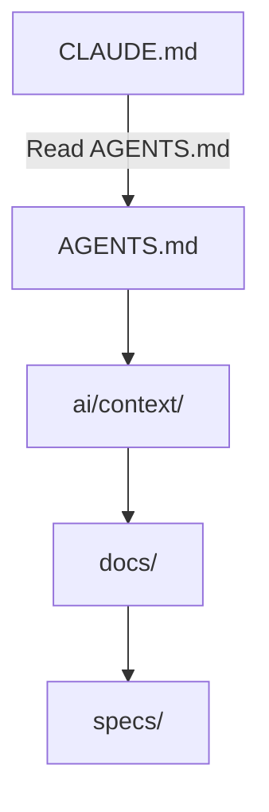

# Uniwersalna struktura projektu dla AI-First Development

> **Cel:** stworzenie uniwersalnej struktury projektu, która działa niezależnie od języka programowania i frameworka, zgodnie z najlepszymi praktykami rozwoju oprogramowania. Działająca dobrze z klientami AI (Claude Code, Cursor, OpenCode, Cline, Roo Code, Codex CLI, Gemini CLI, Windsurf, Antigravity i innymi), tak aby można z nich było korzystać równocześnie lub zmieniać je w przyszłości bez konieczności przebudowy repozytorium.

---

## Filozofia

Nowoczesne repozytorium nie jest już projektowane wyłącznie dla programisty.

Jest projektowane dla:
- Programisty
- AI Assistant
- AI Agent
- Code Review Agent
- DevOps Agent
- Test Agent
- Dokumentacji

Największym ograniczeniem współczesnych modeli LLM nie jest generowanie kodu, ale **zarządzanie kontekstem (Context Management)**.

Dlatego dobra struktura projektu powinna:
- minimalizować zgadywanie przez AI,
- być przewidywalna,
- mieć jedną lokalizację dla każdej informacji,
- rozdzielać wiedzę od implementacji,
- umożliwiać łatwą zmianę klienta AI bez przebudowy repozytorium.

---

## Najważniejsze zasady

### 1. Single Source of Truth (SSOT)

Każda informacja występuje tylko w jednym miejscu.

Źle:

```txt
├── README
├── CLAUDE.md
├── .cursor/rules
├── AGENTS.md
└── docs/
```

wszędzie opis architektury.

Dobrze:

```txt
├── docs/
└── ai/
```

a wszystkie pozostałe pliki jedynie odwołują się do tych źródeł.

---

### 2. AI nie powinno zgadywać

Jeżeli projekt posiada:
- konwencje nazewnictwa,
- architekturę,
- decyzje projektowe,
- workflow,

to powinny być zapisane.

---

### 3. Małe pliki

AI dużo lepiej analizuje:
- pliki 100–300 linii,
- jedną odpowiedzialność na plik,
- małe katalogi.

---

### 4. Dokumentacja blisko kodu

Kod opisuje implementację.

Dokumentacja opisuje:
- dlaczego,
- kiedy,
- jak.

---

### 5. Repozytorium ma być niezależne od IDE

Nie chcemy przepisywać dokumentacji przy zmianie:
- Cursor
- Claude Code
- OpenCode
- Windsurf
- Roo
- Gemini CLI

---

## Wersja MINIMAL (podstawowa)

```txt
project/
├── AGENTS.md
├── README.md
├── ai/
│   ├── context/
│   └── rules/
├── docs/
├── src/
└── tests/
```

---

## Wersja OPTIMAL (zalecana)

```txt
project/
├── AGENTS.md
├── MANIFEST.md
├── README.md
├── CHANGELOG.md
├── ROADMAP.md
├── TODO.md
├── LICENSE
├── ai/
│   ├── context/
│   ├── rules/
│   ├── workflows/
│   ├── prompts/
│   ├── templates/
│   └── memory/
├── specs/
├── docs/
├── decisions/
├── contracts/
├── src/
├── tests/
├── config/
├── scripts/
├── infrastructure/
├── tools/
├── examples/
├── assets/
├── .github/
├── .gitignore
└── tmp/
```

---

## Wersja FULL (AI Native)

```txt
project/
├── AGENTS.md
├── MANIFEST.md
├── README.md
├── CHANGELOG.md
├── ROADMAP.md
├── TODO.md
├── LICENSE
├── ai/
│   ├── context/
│   ├── rules/
│   ├── workflows/
│   ├── prompts/
│   ├── templates/
│   └── memory/
├── specs/
├── knowledge/
├── playbooks/
├── checklists/
├── decisions/
├── contracts/
├── docs/
├── src/
├── tests/
├── infrastructure/
├── config/
├── scripts/
├── tools/
├── examples/
├── plans/
├── experiments/
├── archive/
├── assets/
├── .github/
├── .gitignore
└── tmp/
```

---

## Szczegółowy opis katalogów

---

## AGENTS.md ⭐⭐⭐⭐⭐

Najważniejszy plik dla agentów AI.

Nie przechowuje wiedzy.

Jest **punktem wejścia (Entry Point)**.

Powinien zawierać jedynie:
- gdzie znajduje się dokumentacja,
- jakie reguły obowiązują,
- jakie workflow stosować,
- czego nie robić.

Przykład:

```txt
Read first:
├── ai/context/project.md
├── ai/context/architecture.md

Follow:
├── ai/rules/coding.md

Use workflows:
├── ai/workflows/new-feature.md
```

Nigdy nie duplikujemy wiedzy.

---

## MANIFEST.md ⭐⭐⭐⭐⭐

Mapa całego repozytorium.

To indeks projektu.

Przykład:

```txt
Projekt
├── Architektura
├── Specyfikacje
├── API
├── Workflow
├── Testy
├── ADR
└── Deployment
```

Dzięki temu AI nie musi przeszukiwać całego repozytorium.

---

## ai/

Katalog zawierający instrukcje sterujące zachowaniem agentów AI (reguły, przepływy pracy, prompty, szablony). Chociaż głównym odbiorcą jest AI, programiści również powinni tu zaglądać, aby konfigurować zachowanie asystentów lub zapoznać się z regułami.

---

## ai/context/

Opis projektu.

```txt
├── project.md
├── architecture.md
├── modules.md
├── stack.md
└── glossary.md
```

Zawiera:
- cel projektu,
- moduły,
- architekturę,
- technologie,
- słownik pojęć.

---

## ai/rules/

Reguły obowiązujące AI.

Przykłady:

```txt
├── coding.md
├── testing.md
├── git.md
├── security.md
└── review.md
```

Przykład:

```txt
Maximum file 300 lines

Maximum function 40 lines

Use Composition

No Business Logic in Controllers
```

---

## ai/workflows/

Opis procesów.

Przykład:

```txt
├── new-feature.md
├── bugfix.md
├── refactor.md
└── release.md
```

---

## ai/prompts/

Gotowe prompty.

```txt
├── create-api.md
├── review.md
├── debug.md
└── migration.md
```

---

## ai/templates/

Szablony.

```txt
├── service
├── controller
├── repository
├── migration
├── component
└── endpoint
```

---

## ai/memory/

Pamięć projektu.

```txt
├── known-problems.md
├── technical-debt.md
└── lessons-learned.md
```

---

## specs/

Najważniejszy katalog biznesowy.

Opisuje wymagania.

Nie implementację.

Przykład:

```txt
└── authentication/
    ├── requirements.md
    ├── acceptance.md
    ├── tasks.md
    └── api.md
```

AI znacznie lepiej implementuje funkcjonalność posiadając specyfikację.

---

## knowledge/

Wiedza domenowa.

```txt
├── business.md
├── faq.md
├── terminology.md
├── edge-cases.md
└── legal.md
```

Wiedza domenowa i biznesowa, nie techniczna (ta znajduje się w `docs/`).

**Zasada SSOT:** `knowledge/terminology.md` stanowi nadrzędne źródło pojęć domenowych (biznesowych). Plik `ai/context/glossary.md` powinien jedynie odwoływać się do niego lub definiować pojęcia czysto techniczne/programistyczne (np. specyficzne nazwy zmiennych czy modułów), unikając duplikowania wiedzy biznesowej.

---

## playbooks/

Procedury operacyjne przeznaczone do wykonywania przez ludzi oraz AI (np. kroki wdrożeniowe, reagowanie na awarie, onboarding dewelopera).

**Różnica wobec `ai/workflows/`:** Playbooki to ogólne instrukcje procesowe dla zespołu (ludzi i AI). Z kolei pliki w `ai/workflows/` to techniczne instrukcje krok po kroku przeznaczone **wyłącznie** dla agentów AI, sterujące bezpośrednio ich zachowaniem.

Przykład:

```txt
├── release.md
├── rollback.md
├── incident.md
├── production-hotfix.md
└── onboarding.md
```

---

## checklists/

Checklisty weryfikujące poprawność wykonania poszczególnych zadań.

```txt
├── review.md
├── release.md
├── security.md
└── testing.md
```

**Różnica wobec `playbooks/` (Zgodność z SSOT):** Checklisty określają zwięzłe kryteria weryfikacyjne (np. co sprawdzić przed wydaniem wersji — `release.md`), podczas gdy playbooki opisują pełną procedurę krok po kroku (jak to wydanie fizycznie przeprowadzić — `playbooks/release.md`). AI doskonale sprawdza się w automatycznej weryfikacji takich checklist.

---

## decisions/

Architecture Decision Records (ADR).

Przykład:

```txt
├── 001-postgres.md
├── 002-events.md
└── 003-auth.md
```

Opisujemy:

- decyzję,
- uzasadnienie,
- alternatywy,
- konsekwencje.

AI nie zgaduje dlaczego coś zostało wybrane.

---

## contracts/

Kontrakty.

```txt
├── OpenAPI
├── JSON Schema
├── GraphQL
├── Events
├── gRPC
└── Proto
```

AI nie zgaduje struktur danych.

---

## docs/

Dokumentacja techniczna, systemowa i architektoniczna projektu. Jest przeznaczona do czytania zarówno przez programistów, jak i przez AI w celu zrozumienia kontekstu technicznego systemu.

Przykład:

```txt
├── architecture/
├── database/
├── deployment/
├── api/
├── security/
└── testing/
```

---

## src/

Kod aplikacji.

---

## tests/

Testy.

Najlepiej podzielone analogicznie do src.

---

## config/

Cała konfiguracja.

```txt
├── eslint
├── prettier
├── tsconfig
├── vite
├── webpack
├── nginx
└── docker
```

---

## scripts/

Automatyzacja.

```txt
├── build
├── release
├── backup
├── seed
├── lint
├── generate
└── migration
```

---

## infrastructure/

DevOps.

```txt
├── Docker
├── Terraform
├── Helm
├── Kubernetes
└── Ansible
```

---

## tools/

Narzędzia pomocnicze.

```txt
├── generator
├── cli
├── parser
└── converter
```

---

## examples/

Przykłady.

```txt
├── request.json
├── response.json
├── webhook.json
└── event.json
```

LLM bardzo dobrze uczy się przez przykłady (Few-Shot Learning).

---

## plans/

Plany większych zmian.

```txt
├── migration.md
├── refactor.md
└── caching.md
```

---

## experiments/

Eksperymenty.

```txt
├── RAG
├── LLM
├── Prototype
└── Benchmark
```

Nie mieszamy ich z produkcją.

---

## archive/

Kod historyczny.

```txt
├── legacy/
├── deprecated/
└── old-docs/
```

Pozwala AI odróżnić kod aktywny od starego.

---

## assets/

Pliki statyczne.

```txt
├── images
├── icons
├── fonts
└── pdf
```

---

## tmp/

Pliki tymczasowe.

AI często generuje tymczasowe pliki.

Nie powinny trafiać do src.

---

## README.md

Krótki.

Powinien zawierać:
- opis projektu,
- instalację,
- uruchomienie,
- strukturę,
- link do dokumentacji.

Nie powinien zastępować dokumentacji.

---

## CHANGELOG.md

Historia zmian.

---

## ROADMAP.md

Plan rozwoju.

---

## TODO.md

Aktualne zadania.

---

## Integracja z klientami AI

Każdy klient AI ma własny plik konfiguracyjny.

Przykłady:

```txt
├── AGENTS.md
├── CLAUDE.md
├── .cursor/
├── .clinerules
├── .roo/
├── .windsurf/
└── .github/copilot-instructions.md
```

**Zasada:**
- Żaden z tych plików nie powinien zawierać wiedzy biznesowej ani architektonicznej.
- Powinny jedynie wskazywać lokalizację dokumentacji.

Przykład:



Dzięki temu zmiana IDE nie wymaga przepisywania dokumentacji.

---

## Dobre praktyki dla AI

| Zasada | Korzyść |
|----------|----------|
| Jedna odpowiedzialność na plik | Łatwiejsza analiza przez AI |
| Krótkie pliki (100–300 linii) | Mniejsze zużycie kontekstu |
| Przewidywalne nazwy | AI szybciej odnajduje informacje |
| Dokumentacja blisko kodu | Łatwiejsze zrozumienie projektu |
| ADR (`decisions/`) | AI rozumie decyzje architektoniczne |
| `specs/` | AI implementuje wymagania zamiast zgadywać |
| `contracts/` | Brak domysłów dotyczących struktur danych |
| `examples/` | Few-Shot Learning poprawia jakość odpowiedzi |
| `checklists/` | Powtarzalne procesy i mniej błędów |
| `playbooks/` | Gotowe procedury operacyjne |
| `ai/rules/` | Spójność kodu między sesjami |
| `ai/memory/` | Zachowanie wiedzy o projekcie |
| `MANIFEST.md` | AI szybko odnajduje właściwe pliki |
| `AGENTS.md` | Jeden punkt wejścia dla wszystkich agentów |

---

## Podsumowanie

Nowoczesne repozytorium **AI-First** powinno rozdzielać odpowiedzialności na cztery główne obszary:

| Obszar | Przeznaczenie |
|----------|----------------|
| **Kod (`src/`)** | Implementacja aplikacji |
| **Dokumentacja (`docs/`, `knowledge/`, `specs/`)** | Wiedza dla ludzi oraz opis wymagań biznesowych |
| **Kontekst AI (`ai/`)** | Reguły, workflow, pamięć projektu, szablony i prompty wykorzystywane przez agentów |
| **Integracja z narzędziami AI (`AGENTS.md`, `CLAUDE.md`, `.cursor/`, `.github/copilot-instructions.md` itd.)** | Cienka warstwa wskazująca, gdzie znajduje się właściwy kontekst, bez duplikowania wiedzy |

Tak zaprojektowana struktura:
- jest niezależna od języka programowania i frameworka,
- działa z większością współczesnych klientów AI,
- ułatwia zmianę narzędzia bez migracji dokumentacji,
- minimalizuje błędy wynikające z utraty kontekstu,
- zapewnia spójność pracy ludzi i agentów AI,
- skaluje się od małych aplikacji po duże systemy wielomodułowe.
