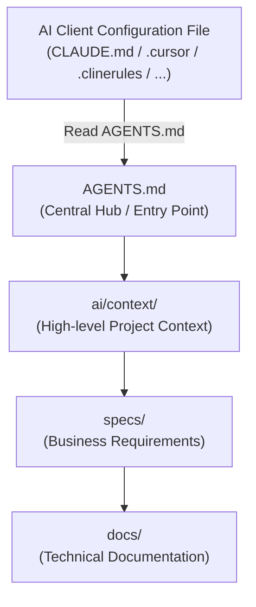

[Previous: Terminology Management](04-terminology-management.md) | [Home (README)](../README.md) | [Next: Initialization Guide ->](06-initialization-guide.md)

---

# Integration with AI Clients

A core goal of `ai-context-tree` is to make the repository independent of the AI tools used. The developer should be able to switch from Cursor to Claude Code, Cline, Windsurf, or Roo Code (or use them simultaneously) without rewriting documentation or duplicating instructions.

## The 2–3 Line Pointer Rule

AI client configuration files (stored in the root or in standard hidden directories) must act **strictly as pointers** to the central instruction file: [AGENTS.md](../AGENTS.md). 

They must:
- Contain **at most 2–3 lines** of instructions.
- Point the model to read `AGENTS.md`.
- Never contain inline code snippets, guidelines, stack overviews, or architectural details.

If the AI client requires a configuration directory (e.g. `.cursor/`, `.roo/`, `.windsurf/`), this pointer rule applies to the *main rules file* inside that directory (e.g. `.cursor/rules/main.mdc` or `.roo/rules.md`).

## Pointer Examples

Here is how you configure various popular AI clients to point to the central `AGENTS.md` file:

### 1. Claude Code (`CLAUDE.md` in root)
```markdown
Refer to AGENTS.md for coding guidelines, architecture, and workflows.
Do not deviate from the workflows defined in ai/workflows/.
```

### 2. Cursor (`.cursorrules` in root)
```markdown
Always read AGENTS.md first to understand the project structure and rules.
Follow the guidelines in ai/rules/coding.md for all code modifications.
```

### 3. Cline / Roo Code (`.clinerules` in root)
```markdown
Read AGENTS.md to understand the repository structure and context.
Adhere strictly to the active guidelines in ai/rules/.
```

### 4. Windsurf (`.windsurfrules` in root)
```markdown
Always read AGENTS.md first to understand the project rules, coding standards, and workflows.
Follow the guidelines in ai/rules/coding.md for code modifications.
```

### 5. GitHub Copilot (`.github/copilot-instructions.md`)
```markdown
Always refer to AGENTS.md in the root directory for general project instructions, tech stack rules, and coding standards.
```

### 6. JetBrains AI Assistant (`.aiassistant/rules/main.md`)
```markdown
# JetBrains AI Assistant Rules
Always refer to AGENTS.md in the project root directory for coding standards, autonomy rules, and workflows.
```

### 7. Aider (`CONVENTIONS.md` in root + `.aider.conf.yml`)
Create `CONVENTIONS.md`:
```markdown
Always read AGENTS.md first to understand coding style, testing rules, and project workflows.
```
Configure `.aider.conf.yml`:
```yaml
read:
  - CONVENTIONS.md
```

### 8. Tabnine (`.tabnine/guidelines/main.md`)
```markdown
# Tabnine Guidelines
Refer to AGENTS.md in the project root for coding rules, testing constraints, and workflows.
```

### 9. Sourcegraph Cody (`.cody/rules.md`)
```markdown
Always read AGENTS.md in the root directory for project-specific rules, tech stack details, and coding conventions.
```

### 10. Antigravity & OpenCode (Natively Supported)
Antigravity and OpenCode automatically discover and parse [AGENTS.md](../AGENTS.md) in the project root directly. No additional thin pointer files are needed for these tools.


## Linking Tool-Specific Rules to Universal Skills

To preserve the **Single Source of Truth (SSOT)**, when an AI client allows defining workspace-scoped rules or skills (such as Cursor's `.cursor/rules/` or Antigravity's `.agents/skills/`), they should not contain duplicate descriptions. Instead, they should act as pointers directing the AI to the universal skill in `ai/skills/`.

### Example: Cursor Rule (.cursor/rules/deploy-skill.mdc)
```markdown
---
globs: scripts/deploy.sh
description: Guidance on executing the production release script
---
Always refer to the custom deployment skill defined in:
- [ai/skills/deployment/SKILL.md](../../ai/skills/deployment/SKILL.md)
Do not duplicate the deployment steps or guidelines here.
```

### Example: Antigravity Workspace Skill (.agents/skills/deploy-skill/SKILL.md)
```markdown
---
name: Deploy Skill
description: Production release instructions pointer
---
Refer to the universal deployment procedure defined in:
- [ai/skills/deployment/SKILL.md](../../../ai/skills/deployment/SKILL.md)
```

---

## Context Flow

The flow of information in an AI-First project goes from the tool configuration to the root entry point, then propagates down to the specific domain guides. This prevents context pollution:



---
[Previous: Terminology Management](04-terminology-management.md) | [Home (README)](../README.md) | [Next: Initialization Guide ->](06-initialization-guide.md)

