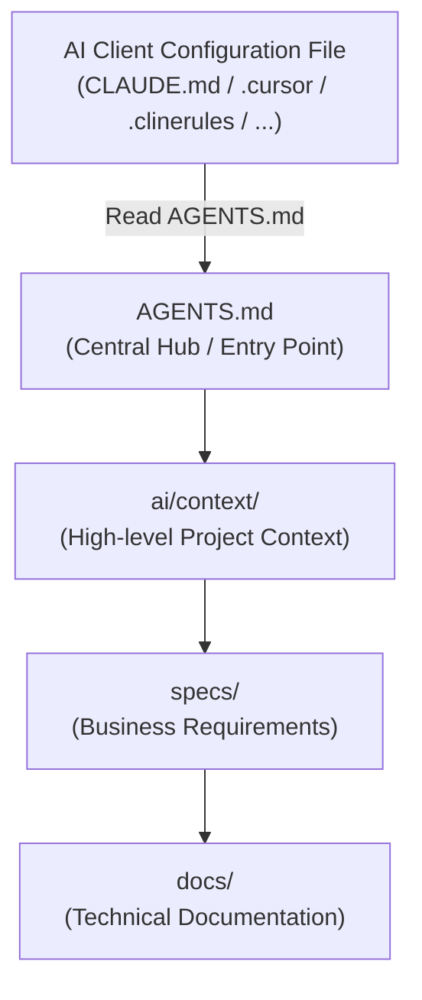

# Integration with AI Clients

A core goal of `ai-context-tree` is to make the repository independent of the AI tools used. The developer should be able to switch from Cursor to Claude Code, Cline, Windsurf, or Roo Code (or use them simultaneously) without rewriting documentation or duplicating instructions.

## The 2–3 Line Pointer Rule

AI client configuration files (stored in the root or in standard hidden directories) must act **strictly as pointers** to the central instruction file: [AGENTS.md](../AGENTS.md). 

They must:
- Contain **at most 2–3 lines** of instructions.
- Point the model to read `AGENTS.md`.
- Never contain inline code snippets, guidelines, stack overviews, or architectural details.

If the AI client requires a configuration directory (e.g. `.cursor/`, `.roo/`, `.windsurf/`), this pointer rule applies to the *main rules file* inside that directory (e.g. `.cursor/rules/main.mdc` or `.roo/rules.md`).

## Pointer Examples

Here is how you configure various popular AI clients:

### For Claude Code (`CLAUDE.md` in root)
```markdown
Refer to AGENTS.md for coding guidelines, architecture, and workflows.
Do not deviate from the workflows defined in ai/workflows/.
```

### For Cursor (`.cursor/rules/main.mdc`)
```markdown
Always read AGENTS.md first to understand the project structure and rules.
Follow the guidelines in ai/rules/coding.md for all code modifications.
```

### For Cline / Roo Code (`.clinerules` in root)
```markdown
Read AGENTS.md to understand the repository structure and context.
Adhere strictly to the active guidelines in ai/rules/.
```

---

## Context Flow

The flow of information in an AI-First project goes from the tool configuration to the root entry point, then propagates down to the specific domain guides. This prevents context pollution:


